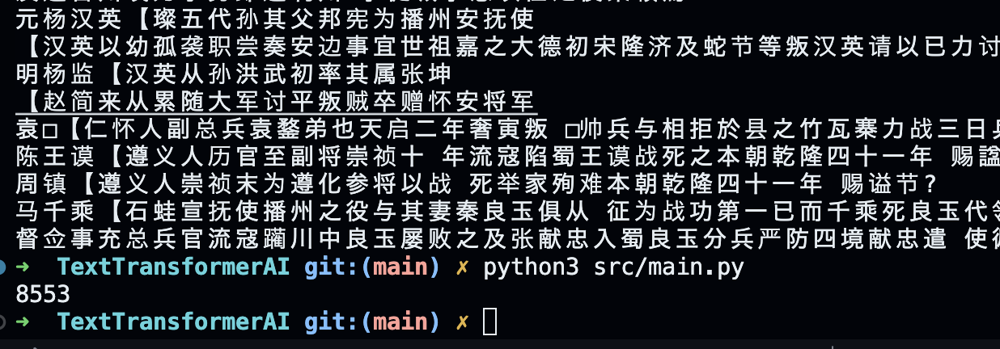
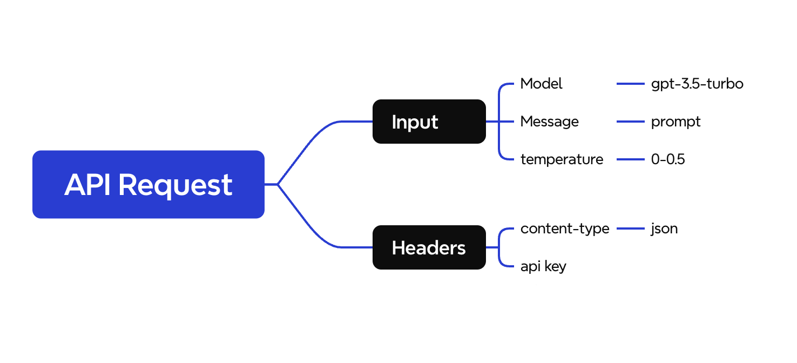

# TextTransformerAI
Automate text processing and OpenAI API interactions in Python. Transform text files into valuable insights, perfect for developers and content creators. Streamline data cleaning, content generation, and insight extraction with ease

## Purpose Cleared
We have a raw txt file consists of roughly 8500 figures from previous dynasty, but the txt is only seperated by "【", "】", and new line. We want to extract their name, position, tribute, hometown, etc and store all the information into a `xlsx` file with those columns.

## Steps
### 1. Turn `txt` file into an array of string
Firstly split the txt by new line, and in every new line we split by "】". We have 2 for loops, and we only insert each person into the array to avoid further splitting. Also to notice eliminating the empty one by filtering the lentgh.

```python
def read_txt(file_path):
    data = []
    with open(file_path, "r", encoding="utf-8") as file:
        text = file.read()
        split_text = text.split('\n')
        for entry in split_text:
            people = entry.split('】')
            for person in people:
                if len(person) > 0:
                    data.append(person)
    return data
```

And we can see we have roughly 8553 person in the text file.<br>

### 2. Feed the array into LLM
Now we are picking GPT-turbo-3.5 as our model. So we will take the array we have from last step to GPT, and get the target output that we want.
- Raw data entry: "明田载【北平人永乐中知铜仁府时初立郡载结庐听政招集遗氓踰年官署学宫规制渐备外 驯蛮獠内抚疮痍民赖以安】"
- Output format: '人物姓名', '最高官职', '功名', '籍贯（哪里人）', '所处朝代', '入志缘由', '入志原因', '其他'
- Target output: 明田载, 知府, NA, 北平人, 明朝，抚疮痍民，5 (Could be wrapped in quotes "")<br>

**Making API request to OpenAI**<br>


**How to optimize large scale API calls?**<br>
Some questions:
- If the process takes too long to finish, how do we store the already processed data?

**Price calculation**
- How do we chunk the array to make each api request?
  - 15 rows of array as one api request, we will have roughtly 8500/15 = 567 api requests.
  - In each request, we have 15 rows, each row is a person's info consists of：
    - 50 CH Chars: 明田载【北平人永乐中知铜仁府时初立郡载结庐听政招集遗氓踰年官署学宫规制渐备外 驯蛮獠内抚疮痍民赖以安】
    - According to [OpenAI's tokenizer](https://platform.openai.com/tokenizer), roughly 80 tokens.
    - So each request will cost 80 * 15 = 1.2K tokens
- The total tokens cost will be: 1.2k * 567 = 680.4K = 0.68M tokens, the price for gpt-3.5-turbo is intput: \$0.50 / 1M tokens, Output: \$1.50 / 1M tokens. So the input will be $0.34, output to be calculated.


### 3. Further process the output from step 2
We will have roughly 8500 entries of the data like "明田载, 知府, NA, 北平人, 明朝，抚疮痍民，5", we store them either in:
- An array of 8500 rows * 1 column
  - Then traverse the array and insert them into `xlsx` file, each column is seperated by comma in the entry
- A `csv` file with 8500 rows ✅
  - Turn the array into csv, it's easier this way, since we can first turn the array into a dataframe, and directly use `to_excel` to a `xlsx` file.

